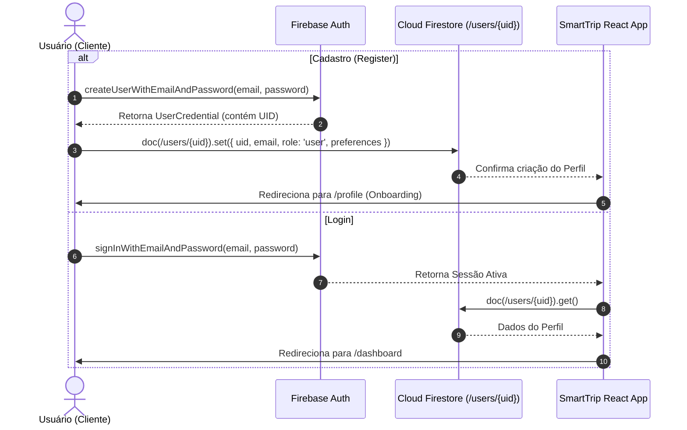

# SPEC Técnica de Autenticação - SmartTrip (Firebase Auth)

> **Projeto:** SmartTrip - Assistente Inteligente de Viagens  
> **Documento:** Especificação Técnica de Autenticação, Perfis de Usuário e Proteção de Rotas  
> **Versão:** 1.0.0  
> **Status:** Aprovado  

---

## 1. Visão Geral

O módulo de Autenticação do **SmartTrip** é responsável pelo gerenciamento de identidades, criação de perfis no Cloud Firestore, segurança de sessão e restrição de acesso a rotas privadas. Ele combina o **Firebase Authentication** com documentos de perfil vinculados na coleção `/users/{uid}`, garantindo o isolamento total de dados entre viajantes.

---

## 2. Princípios Fundamentais de Segurança

* **SEC-AUTH-01 (Confiança Zero no Cliente):** A aplicação jamais confiará em um `userId` ou `uid` enviado no corpo da requisição ou parâmetros de formulário. O identificador do usuário para qualquer operação de leitura ou escrita será extraído **exclusivamente do token de autenticação validado** (`request.auth.uid` no Firestore Security Rules ou `context.auth.uid` em funções de servidor).
* **SEC-AUTH-02 (Papel Padrão & Prevenção de Autoelevação):**
  - Todo novo cadastro criará obrigatoriamente um perfil com papel padrão `role: "user"`.
  - O campo `role` não pode ser definido nem alterado diretamente pelo cliente no momento do cadastro ou edição de perfil.
  - A atribuição de privilégios de administrador (`role: "admin"`) ocorrerá unicamente via backend/Firebase Admin SDK ou Custom Claims.
  - As regras de segurança do Firestore proibirão qualquer requisição vinda do cliente que tente alterar o campo `role`.

---

## 3. Fluxos Operacionais de Autenticação



### 3.1 Cadastro por E-mail / Senha
1. O usuário preenche nome, e-mail, senha (mínimo de 6 caracteres) e confirmação de senha.
2. O sistema invoca `createUserWithEmailAndPassword(auth, email, password)`.
3. Ao obter o `UID` gerado pelo Firebase Auth, o sistema cria o documento `/users/{uid}` no Cloud Firestore contendo:
   ```json
   {
     "uid": "{uid}",
     "email": "usuario@exemplo.com",
     "displayName": "Nome do Usuário",
     "role": "user",
     "createdAt": "serverTimestamp()",
     "preferences": {
       "styles": ["Gastronomia", "Cultura"],
       "budget": "moderado",
       "pace": "tranquilo"
     }
   }
   ```
4. Concluído o processo, o usuário é redirecionado para a rota `/profile` para personalização inicial.

### 3.2 Login de Usuário (E-mail/Senha e Google OAuth)
1. **E-mail/Senha:** O usuário insere e-mail e senha e o sistema executa `signInWithEmailAndPassword(auth, email, password)`.
2. **Google OAuth:** O usuário clica em "Continuar com Google" e o sistema invoca `signInWithPopup(auth, googleProvider)`.
3. Se o documento `/users/{uid}` não existir (ex: primeiro login com Google), o sistema o cria automaticamente com o papel `user`.
4. Em caso de sucesso, o usuário é redirecionado automaticamente para `/dashboard`.

### 3.3 Logout Seguro
1. O usuário clica no botão "Encerrar Sessão".
2. O sistema invoca `signOut(auth)`.
3. A sessão local é limpa e o estado no `AuthContext` é atualizado para `user: null`.
4. O usuário é redirecionado para a página pública `/login`.

### 3.4 Recuperação de Senha
1. O usuário insere seu e-mail no formulário de recuperação e clica em "Esqueci minha senha".
2. O sistema invoca `sendPasswordResetEmail(auth, email)`.
3. É exibida mensagem de confirmação: *"Instruções para redefinição de senha enviadas para seu e-mail."*

---

## 4. Gerenciamento de Sessão & Proteção de Rotas

### 4.1 Persistência de Sessão
* Persistência configurada em `browserLocalPersistence` no Firebase Auth, permitindo que a sessão sobreviva ao fechamento do navegador.
* O componente `AuthProvider` manterá um listener ativo com `onAuthStateChanged(auth, callback)` para atualizar a aplicação em tempo real caso a sessão expire ou seja alterada.

### 4.2 Matriz de Proteção de Rotas & Redirecionamentos

| Rota | Tipo | Comportamento se NÃO Autenticado | Comportamento se AUTENTICADO |
| :--- | :---: | :--- | :--- |
| `/` | Pública | Exibe Landing Page. | Redireciona automaticamente para `/dashboard`. |
| `/login` | Pública | Exibe Formulário de Login. | Redireciona automaticamente para `/dashboard`. |
| `/register` | Pública | Exibe Formulário de Cadastro. | Redireciona automaticamente para `/dashboard`. |
| `/dashboard` | **Privada** | Redireciona para `/login` (salva rota original). | Exibe Dashboard. |
| `/profile` | **Privada** | Redireciona para `/login`. | Exibe Perfil & Preferências. |
| `/availability` | **Privada** | Redireciona para `/login`. | Exibe Gestão de Folgas. |
| `/explore` | **Privada** | Redireciona para `/login`. | Exibe Busca & IA. |
| `/trips` | **Privada** | Redireciona para `/login`. | Exibe Minhas Viagens. |
| `/trips/[id]` | **Privada** | Redireciona para `/login`. | Exibe Detalhes do Roteiro. |

---

## 5. Estrutura do Documento de Perfil (`/users/{uid}`) & Papéis (`role`)

### 5.1 Schema TypeScript do Documento do Firestore
```typescript
export interface UserDocument {
  uid: string;
  email: string;
  displayName: string;
  photoURL?: string;
  role: 'user' | 'admin'; // Padrão imutável pelo cliente: 'user'
  createdAt: any; // FieldValue.serverTimestamp()
  updatedAt?: any;
  preferences: {
    styles: string[];
    budget: 'economico' | 'moderado' | 'luxo';
    pace: 'tranquilo' | 'moderado' | 'intenso';
  };
}
```

### 5.2 Trava de Segurança no Firestore (`firestore.rules`)
Regra explícita impedindo autoelevação de papel pelo cliente:

```javascript
// Impede que o cliente altere seu próprio campo 'role'
function notChangingRole() {
  return !request.resource.data.diff(resource.data).affectedKeys().hasAny(['role']);
}

match /users/{userId} {
  // Permite criar o próprio perfil apenas se role == 'user'
  allow create: if request.auth != null 
                && request.auth.uid == userId 
                && request.resource.data.role == 'user';
                
  // Permite atualizar preferências mas PROÍBE alterar role
  allow update: if request.auth != null 
                && request.auth.uid == userId 
                && notChangingRole();
}
```

---

## 6. Mapeamento de Mensagens de Erro em Português

O sistema tratará os códigos de erro padrão do Firebase Auth, convertendo-os em mensagens amigáveis na UI:

| Código de Erro Firebase | Mensagem Exibida na UI (Português) |
| :--- | :--- |
| `auth/invalid-email` | "O e-mail digitado possui um formato inválido." |
| `auth/user-not-found` | "Nenhuma conta encontrada com este e-mail." |
| `auth/wrong-password` | "Senha incorreta. Tente novamente." |
| `auth/invalid-credential` | "Credenciais de acesso inválidas. Verifique seu e-mail e senha." |
| `auth/email-already-in-use` | "Este e-mail já está cadastrado no sistema." |
| `auth/weak-password` | "A senha deve conter no mínimo 6 caracteres." |
| `auth/popup-closed-by-user` | "O fluxo de login com Google foi cancelado antes da conclusão." |
| `auth/network-request-failed` | "Erro de conexão. Verifique sua internet." |

---

## 7. Estratégia de Testes (Validação de Isolamento com Dois Usuários)

Para garantir o estrito isolamento de dados e validar as regras de segurança do Firestore, a suíte de testes (manual e automatizada) executará os seguintes cenários com **dois usuários distintos**:

* **Usuário A:** `fernanda@smarttrip.com` (`uid_fernanda_123`)
* **Usuário B:** `lucas@smarttrip.com` (`uid_lucas_456`)

### Casos de Teste de Isolamento:
1. **Teste 1 (Isolamento de Perfil):** O Usuário A logado tenta ler o documento `/users/uid_lucas_456`.
   - *Resultado Esperado:* **ACESSO NEGADO (PERMISSION_DENIED)** pelo Firestore Security Rules.
2. **Teste 2 (Isolamento de Roteiro):** O Usuário A logado tenta listar as viagens na sub-coleção `/users/uid_lucas_456/trips`.
   - *Resultado Esperado:* **ACESSO NEGADO (PERMISSION_DENIED)**.
3. **Teste 3 (Tentativa de Autoelevação):** O Usuário A tenta enviar um `update` no seu documento `/users/uid_fernanda_123` alterando `"role": "admin"`.
   - *Resultado Esperado:* **ACESSO NEGADO (PERMISSION_DENIED)**.
4. **Teste 4 (Troca de Sessão):** Fazer logout do Usuário A e login do Usuário B. Confirmar que o `AuthContext` atualiza o estado para os dados exclusivos do Usuário B.

---

## 8. Critérios de Aceite da Autenticação (CA-AUTH)

* **`CA-AUTH-001` (Cadastro com Perfil Automático):** Todo cadastro efetuado via `createUserWithEmailAndPassword` deve automaticamente criar o documento no Firestore `/users/{uid}` com `role: "user"`.
* **`CA-AUTH-002` (Login com Google):** O login social com Google deve criar o perfil no Firestore se for o primeiro acesso e manter o usuário autenticado.
* **`CA-AUTH-003` (Guards de Rota Privada):** Tentativas de acessar `/dashboard`, `/profile`, `/availability`, `/explore` ou `/trips` sem sessão ativa devem redirecionar imediatamente para `/login`.
* **`CA-AUTH-004` (Redirecionamento Pós-Login):** Ao efetuar login ou cadastro com sucesso, o usuário deve ser redirecionado automaticamente para `/dashboard` (ou `/profile` no primeiro cadastro).
* **`CA-AUTH-005` (Logout Limpo):** O clique em "Encerrar Sessão" deve revogar a sessão no Firebase Auth, limpar o contexto React e redirecionar para `/login`.
* **`CA-AUTH-006` (Recuperação de Senha):** O envio do formulário de redefinição de senha deve invocar `sendPasswordResetEmail` e exibir feedback visual na tela.
* **`CA-AUTH-007` (Prevenção de Autoelevação de Papel):** Requisições do cliente tentando alterar o atributo `role` de um documento de usuário devem falhar com erro de segurança.
* **`CA-AUTH-008` (Isolamento entre Dois Usuários):** Leitura de dados cruzados entre `uid_fernanda` e `uid_lucas` deve ser bloqueada pelas regras de segurança.
* **`CA-AUTH-009` (Mensagens em Português):** Qualquer exceção do Firebase Auth deve ser traduzida e exibida em português no formulário.
